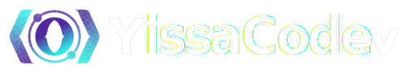

    
        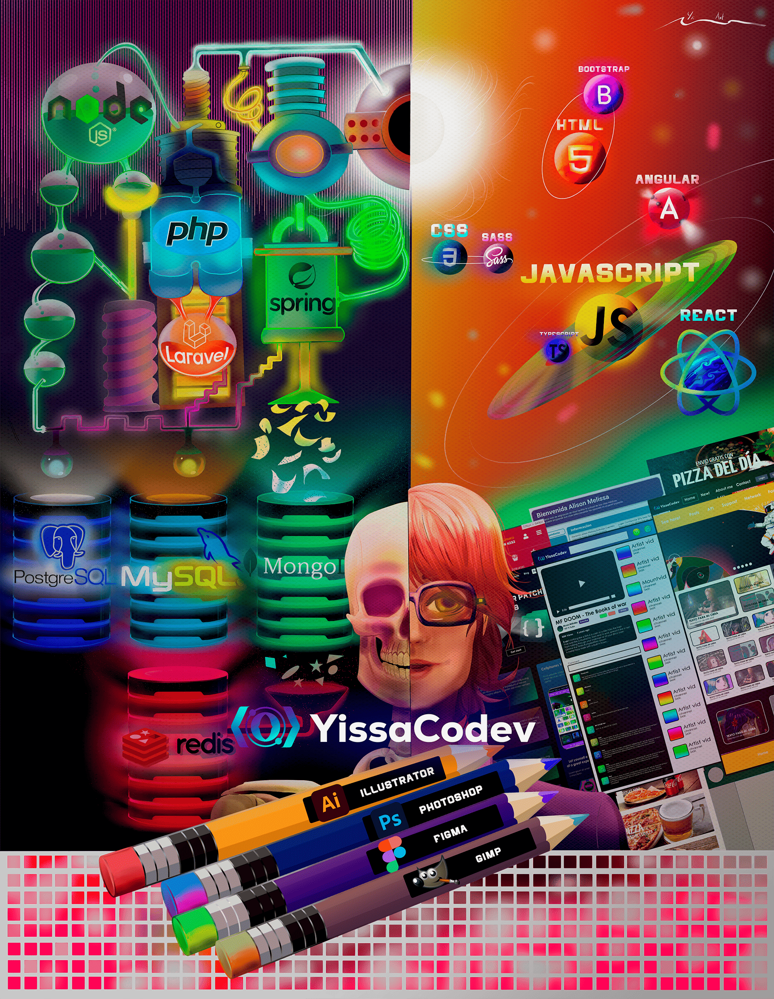

## Hey 🐱, I'm Yessid Acosta! 
I am a versatilist developer and easily adapt to different programming areas like:

- Frontend development 🌐
- Backend development 🤖 
- UI/UX Designer 🎨 (depending on what the project requires. )

### 🔨 Languages and Tools:
#### Frontend

<a href="https://html.spec.whatwg.org/multipage/" target="_blank"> 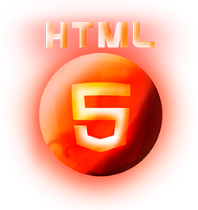 </a> 
<a href="https://www.w3.org/Style/CSS/specs.en.html" target="_blank"> 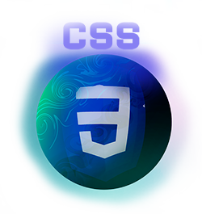 </a> 
<a href="https://www.ecma-international.org/publications-and-standards/standards/ecma-262/" target="_blank"> 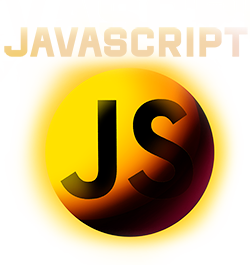</a> 
<a href="https://sass-lang.com" target="_blank"> 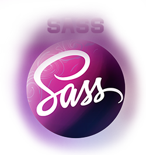 </a> 
<a href="https://getbootstrap.com" target="_blank"> 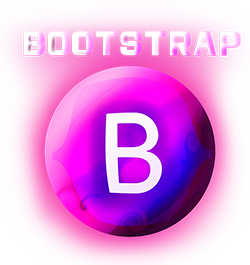 </a> 
<a href="https://angular.io" target="_blank"> 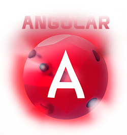 </a> 
<a href="https://es.react.dev" target="_blank"> 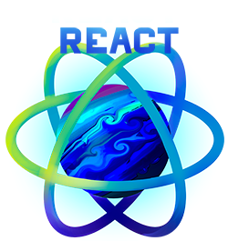 </a> 

    

#### Backend
<a href="nodejs.org" target="_blank"> 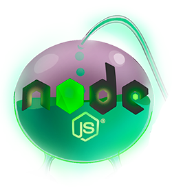 </a> 
<a href="https://spring.io" target="_blank"> 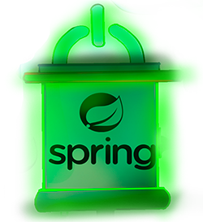 </a> 
<a href="https://www.php.net" target="_blank"> 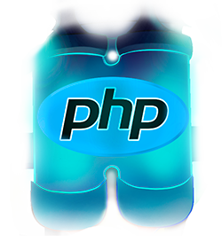 </a> 
<a href="https://laravel.com" target="_blank"> 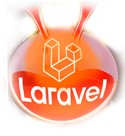 </a> 

    
#### Data
<a href="https://www.mysql.com" target="_blank"> 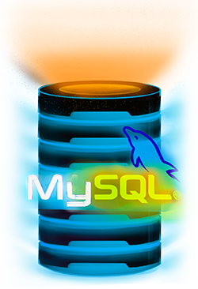 </a> 
<a href="https://www.postgresql.org" target="_blank"> 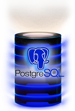 </a> 
<a href="https://www.mongodb.com/" target="_blank"> 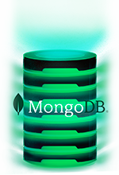 </a> 
<a href="https://redis.io" target="_blank"> 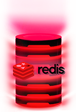 </a> 

       

#### UI/UX Design
<a href="www.adobe.com" target="_blank"> 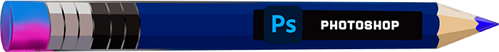 </a> 
<a href="www.adobe.com" target="_blank"> 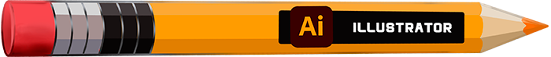 </a>  
<a href="https://www.figma.com" target="_blank"> 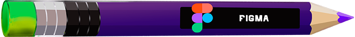 </a> 
<a href="http://www.gimp.org.es" target="_blank"> 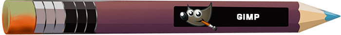 </a> 

 

### 🧐 More About Me:

- 🔭 &nbsp; I’m currently learning Redis Database
- 🤝 &nbsp; I’m working on a PHP CRUD of film content
- 🌱 &nbsp; I’m currently learning SVG; 
- 👨🏻‍💻 &nbsp; Most of my projects are available on [Github](https://github.com/yissacodev?tab=repositories)
- 💬 &nbsp; Ask me about anything tech and web design related, I am happy to help;
- 📫 &nbsp; Feel free to ping me on [LinkedIn](https://www.linkedin.com/)
- 📝 &nbsp; Checkout my [resume](https://drive.google.com/file/)
- 📚 &nbsp; In addition to programming, I also like to design small icons, banners and illustrations.

### Social Media
<!--
**acosta032/acosta032** is a ✨ _special_ ✨ repository because its `README.md` (this file) appears on your GitHub profile.

Here are some ideas to get you started:

- 🔭 I’m currently working on ...
- 🌱 I’m currently learning ...
- 👯 I’m looking to collaborate on ...
- 🤔 I’m looking for help with ...
- 💬 Ask me about ...
- 📫 How to reach me: ...
- 😄 Pronouns: ...
- ⚡ Fun fact: ....
-->
